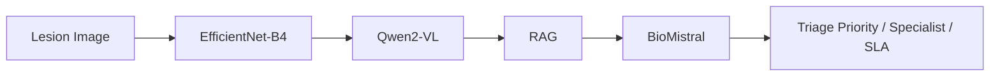
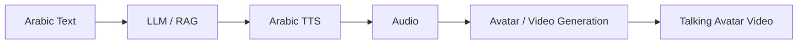

<h1 align="center">Basil Babu</h1>

  <strong>Full-Stack Engineer · AI Engineering · Product Development</strong> 
  Building real products across the stack — from React interfaces to self-hosted AI models on GPUs.

  
  

---

## 👋 Hi, I'm Basil

I'm a **Full-Stack Engineer from India with 6+ years of professional experience** building web and mobile products.

My engineering foundation is in **React, Next.js, TypeScript, and frontend architecture**, with extensive backend experience across **Node.js, NestJS, Go, REST APIs, databases, and real-time systems**.

My work has increasingly moved toward **AI engineering** — taking open-source models, running them on GPUs, connecting them into practical pipelines, and exposing them through APIs that real applications can use.

I'm particularly interested in the engineering between **a model and a production-ready product**: inference, orchestration, APIs, performance, GPU infrastructure, and deployment.

* 🔨 **Building:** Arabic AI talking-avatar pipeline
* 🧠 **Working with:** LLMs, RAG, multimodal AI, computer vision, TTS, and AI video
* 🏥 **Worked on:** DermaTriage, an AI skin-lesion triage system for the University of Milan
* ⚡ **Interested in:** Production AI, self-hosted models, GPU inference, and AI agents

---

## 🚀 Featured Work

### 🏥 DermaTriage — AI Skin-Lesion Triage

Developed for the **University of Milan** and integrated with the B4 platform.

The system processes a skin-lesion image and combines computer vision, multimodal AI, retrieval, and a biomedical LLM to produce a **triage priority, specialist recommendation, and SLA**.

`Python` `FastAPI` `EfficientNet-B4` `Qwen2-VL` `RAG` `BioMistral` `Computer Vision`

---

### 🗣️ Arabic Talking Avatar

An end-to-end pipeline for building **Arabic-speaking AI avatars** with natural speech and movement, with a particular interest in Arabic dialects.

The engineering focuses on evaluating open-source speech and video models, running inference on GPUs, and connecting the individual components into a unified service.

`XTTS-v2` `Chatterbox` `Habibi-TTS` `LatentSync` `MuseTalk` `Wav2Lip` `CUDA` `FastAPI`

---

## 💻 Other Projects

| Project                     | Description                                                                                                                                          | Stack                                                     |
| --------------------------- | ---------------------------------------------------------------------------------------------------------------------------------------------------- | --------------------------------------------------------- |
| **SmartFX**                 | Financial/trading mobile application with authentication, OTP, user & demo accounts, transactions, bank accounts, document management, and analytics | Flutter · Dart · GetX · REST · PHP/Yii · MySQL · Firebase |
| **Whipflip Dealer Direct**  | Vehicle trading and dealer management platform                                                                                                       | React · Next.js · Node.js · MongoDB                       |
| **Hilton Hotel Monitoring** | Web application for monitoring hotel operations                                                                                                      | Web Technologies                                          |
| **NestBoard**               | Developer tool that generates CRUD APIs for NestJS from a dashboard, with tools to manage and organize APIs                                          | NestJS · npm                                              |
| **Cuidar**                  | Community donation platform where people can list items they want to donate and others can contact the giver directly                                | Web / Mobile                                              |

---

## 🛠️ Tech Stack

### Frontend

  

### Backend & Databases

  

### Mobile

  

### AI / ML

  
  
  

### Infrastructure & Tools

  

**Also:** Ant Design · Babel · ESLint · Sequelize · REST · WebSockets · Pusher · NPM

---

## 🤖 AI Engineering

### Areas

`LLMs` `RAG` `Multimodal AI` `Vision-Language Models` `AI Agents` `Computer Vision` `Medical AI` `TTS` `AI Video` `GPU Inference` `Model Deployment` `Quantized Models` `Self-Hosted AI`

### Models & Technologies

`Qwen` `Qwen2-VL` `Qwen3-TTS` `BioMistral` `Falcon Arabic` `XTTS-v2` `Chatterbox` `Fish Speech` `Habibi-TTS` `LatentSync` `MuseTalk` `Wav2Lip` `Veo`

---

## 🎯 Where I'm Heading

I'm continuing to build full-stack products while moving deeper into **production AI engineering**.

My current interests sit at the intersection of:

**Full-Stack Engineering**
↓
**LLM Applications**
↓
**Multimodal AI**
↓
**AI Agents**
↓
**Self-Hosted Models**
↓
**GPU Inference & Deployment**

I'm particularly interested in **Arabic and dialectal speech**, multimodal applications, AI agents, and turning open-source models into reliable products.

If you're building something interesting in this space, I'd love to hear about it.

---

  <i>Build. Experiment. Ship.</i>

